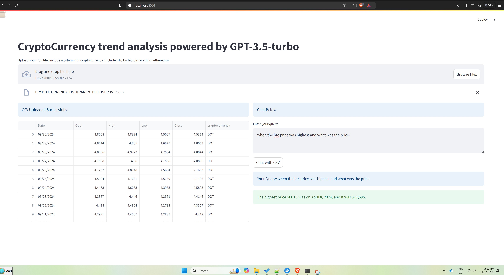
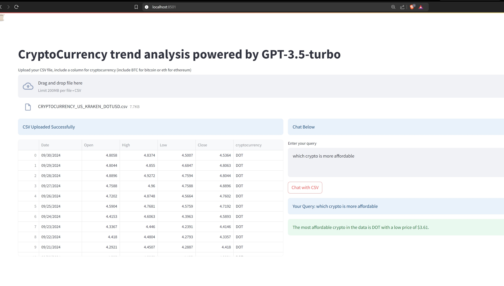
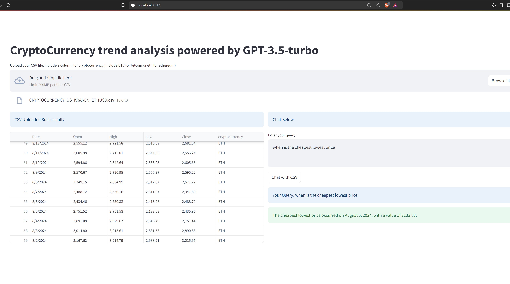

# LLM SQL Agent
A conversational AI agent that interacts with a SQL database to provide information on cryptocurrencies.

##  Overview
This project leverages Large Language Models (LLMs), SQL databases and StreamlitUI deployed in docker, to create a conversational AI chat-based interface for querying real-time cryptocurrency data, including prices, trends, and comparitive analysis.

## Features
- Interact with a SQL database using natural language queries
- Retrieve cryptocurrency data (e.g., prices, trends)
- Supports multiple cryptocurrencies (e.g., Bitcoin, Ethereum)
- Built using LLMs for accurate and informative responses
- Streamlit-based UI for easy user interaction
  
## Technologies Used
- Large Language Models (LLMs) (OpenAI)
- SQL databases (MySQL)
- Streamlit for UI
- Python 3.x
- Framework used : Langchain

## Technologies Used
- Data is downloaded from www.marketwatch.com
- I tested this project on BTC, ETH, SOL and DOT.(Refer the data folder for the links)
- Sample url for downloading btcusd file is as below 
https://www.marketwatch.com/investing/cryptocurrency/btcusd/download-data?startDate=4/1/2024&endDate=9/30/2024

### Here are the advantages of using the LLM SQL Agent application:

#### User Benefits
- Easy access to cryptocurrency data
- Natural language querying for non-technical users
- Fast and accurate responses
- Interactive chat interface for improved user experience
- Supports multiple cryptocurrencies

#### Business Benefits
- Enhanced decision-making with data-driven insights
- Improved operational efficiency through automation
- Reduced manual data analysis and querying time
- Scalable solution for growing cryptocurrency datasets
- Integration with existing SQL databases

####  Technical Benefits
- Leverages Large Language Models (LLMs) for accurate responses
- Utilizes SQL databases for structured data storage
- Streamlit-based UI for easy deployment and maintenance
- Modular architecture for easy extension and customization
- Compatible with various cryptocurrency data sources

#### Analytical Benefits
- Real-time data analysis and visualization
- Identifies trends and patterns in cryptocurrency markets
- Provides actionable insights for investment decisions
- Supports historical data analysis for predictive modeling
- Enables data-driven strategy development

#### Educational Benefits
- Interactive learning tool for cryptocurrency and data analysis
- Demonstrates applications of LLMs and SQL databases
- Develops critical thinking and problem-solving skills
- Enhances data literacy and interpretation abilities
- Supports academic research and projects
  
By using the LLM SQL Agent application, users can unlock these benefits and improve their cryptocurrency data analysis and decision-making processes.

<h2> How to run our LLM SQL Agent</h2>

<b>OpenAI</b><br/>
- OpenAI provides the API for accessing powerful language models like GPT-3.5 Turbo.<br/>
- In this application, the OpenAI API is used to generate responses based on the data retrieved from Elasticsearch, for the query passed from the chatbot.<br/>

**Note:** OpenAI immediately revokes the API key once it detects that the key has been exposed publicly. Therefore, do not expose your API key.<br/>
<br/>
Generate your OpenAI API key here: [Click Here](https://platform.openai.com/account/api-keys)

1. Clone this git repository from command prompt<br/>
git clone https://github.com/padmapria/llm_sql_agent.git    
cd llm_sql_agent    

2. Create a `.env` file inside both the 'app' folder and the notebooks folder and store the key as follows:     
OPENAI_API_KEY=YOUR_API_KEY_HERE<br/>

. Refer to the key in `rag.py` by:  
```python   
from dotenv import load_dotenv   
load_dotenv()   
openai_api_key = os.getenv("OPENAI_API_KEY")    
```
3. The application can be tested via jupyter notebook or via streamlit UI deployed via docker.

## Deploy via docker 
1. Install Docker Desktop on your computer and start Docker Desktop    

2. Start the application by running the command from the command prompt <br/>
docker compose up -d

3. Access the deployed application from the brower..        
http://localhost:8501

## Test the application via UI
- Upload a CSV file containing cryptocurrency data
- Enter natural language queries in the chat interface
- Receive informative responses from the LLM SQL agent
  
  
  

### Acknowledgement
Thank you to www.marketwatch.com for the data, Langchain team and OpenAI for providing access to their LLM model APIs.
